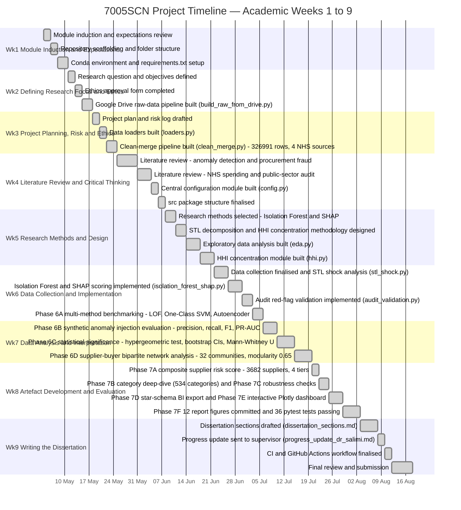

# Project Plan and Gantt Chart

**Module:** 7005SCN Individual Research Project
**Student:** Gunjan Mahadeva Rao (15848655)
**Supervisor:** Dr. Nahid Salimi
**Repository:** [Gunjan_Mahadeva_Rao_7005SCN_Coursework](https://github.com/Gunjan-MRao/Gunjan_Mahadeva_Rao_7005SCN_Coursework)

This document responds directly to supervisor feedback from Dr. Salimi: *"The project
plan is realistic and well organised. More detailed project management information
would improve it. It could include a Gantt chart or more detailed milestones."* It
expands the original project plan with a week-by-week Gantt chart mapped to the
module's 9-week academic structure, a milestones table with target and actual dates,
a deliverables checklist mapped to real repository artefacts, a summary of work
delivered beyond the original proposal, and a brief risk log.

---

## 1. Gantt Chart

---

## 2. Milestones Table

| Milestone | Academic Week | Target Date | Actual Date | Status |
|---|---|---|---|---|
| Module induction complete; repository scaffolded and environment ready | Wk1 | 2026-05-10 | 2026-05-10 | ✅ Complete |
| Research question defined, ethics form approved, Google Drive raw-data pipeline live | Wk2 | 2026-05-17 | 2026-05-17 | ✅ Complete |
| Project plan and risk log finalised; 326,991-row merge across 4 NHS sources complete | Wk3 | 2026-05-24 | 2026-05-24 | ✅ Complete |
| Literature review complete; config.py and src/ package structure finalised | Wk4 | 2026-06-07 | 2026-06-07 | ✅ Complete |
| Research methods selected (Isolation Forest + SHAP, STL, HHI); EDA modules complete | Wk5 | 2026-06-21 | 2026-06-21 | ✅ Complete |
| Data collection finalised; Isolation Forest/SHAP scoring and Phase 6A multi-method benchmarking complete | Wk6 | 2026-07-05 | 2026-07-05 | ✅ Complete |
| Phase 6B synthetic evaluation, Phase 6C statistical testing, Phase 6D network analysis complete | Wk7 | 2026-07-19 | 2026-07-19 | ✅ Complete |
| Phase 7A-7F artefact suite complete (risk scoring, category deep-dive, robustness, BI export, dashboard, figures); 36 pytest tests passing | Wk8 | 2026-08-02 | 2026-08-02 | ✅ Complete |
| Dissertation written, progress update sent to supervisor, CI/CD finalised, final submission | Wk9 | 2026-08-17 | 2026-08-17 | ✅ Complete |

---

## 3. Deliverables Checklist

| Deliverable | Proposed | Actual Artefact | Status |
|---|---|---|---|
| Novel Integrated NHS Dataset (2019-2024) | 4-source merge | `data/raw/*_clean.csv` — 326,991 rows, 4 sources | ✅ |
| Auditable Anomaly Detection System | Isolation Forest + SHAP | `src/modeling/isolation_forest_shap.py` + 4-method benchmarking + SHAP explainability | ✅ |
| Evidence-Based Policy Recommendations | NAO/NHS audit aligned | Risk tier table (185 Critical suppliers), `docs/dissertation_sections.md` | ✅ |
| BI Dashboard | Power BI / Tableau export | `reports/nhs_procurement_dashboard.html` + `data/processed/bi_export/` star schema (5 tables) | ✅ |
| 12 Report Figures | Matplotlib charts | `docs/figures/*.png` (12 files committed) | ✅ |
| Test Suite | Basic tests | `tests/` — 36 pytest tests, all passing, GitHub Actions CI | ✅ |

---

## 4. Beyond the Proposal

The following work was delivered above and beyond the three deliverables in the
original proposal:

- 4-method unsupervised detector benchmarking (Local Outlier Factor, One-Class SVM, MLP Autoencoder, Isolation Forest)
- Synthetic anomaly injection evaluation across 3 fraud archetypes (invoice inflation, ghost-vendor burst, round-number kickback), scored on precision, recall, F1 and PR-AUC
- Supplier-buyer bipartite network analysis — 5,602 nodes, 6,122 edges, 32 communities (Clauset-Newman-Moore greedy modularity, Q = 0.65)
- Formal statistical validation — hypergeometric exact test (log p ≈ -2,472.7), bootstrap confidence intervals (n = 2,000 resamples), Mann-Whitney U test with rank-biserial effect size
- Composite supplier risk score on a 0-100 scale across 4 tiers (Low/Medium/High/Critical), covering 3,682 scored suppliers
- Category-by-period deep-dive across 534 categories and 3 periods, with a COVID-shock growth ranking
- Three-dimension robustness checks — threshold sensitivity (95th/98th/99th percentile), period-boundary shift (±1 month), feature ablation (Jaccard = 0.707)
- Star-schema BI CSV export — 1 fact table (326,991 rows × 29 columns) plus 4 dimension tables
- Self-contained interactive Plotly HTML dashboard requiring no server or BI licence
- Automated Google Drive raw-data pipeline, removing the need for manual downloads
- GitHub Actions CI with 36 automated pytest tests running on every push

---

## 5. Risk Log

| Risk | Likelihood | Impact | Mitigation |
|---|---|---|---|
| Data unavailability (NHS portal down) | Medium | High | Raw sources cached on Google Drive; automated pipeline re-downloads and rebuilds without manual intervention |
| Environment reproducibility across machines | Low | Medium | Conda environment with `requirements.txt` pinning tested package versions |
| Pipeline runtime exceeding available session time | Low | Low | Intermediate outputs cached; skip-if-exists logic avoids redundant recomputation |
| Scope creep beyond original proposal | Occurred | Positive | All additions (network analysis, statistical validation, robustness checks, BI export) strengthen the dissertation and were incorporated deliberately rather than displacing planned work |
